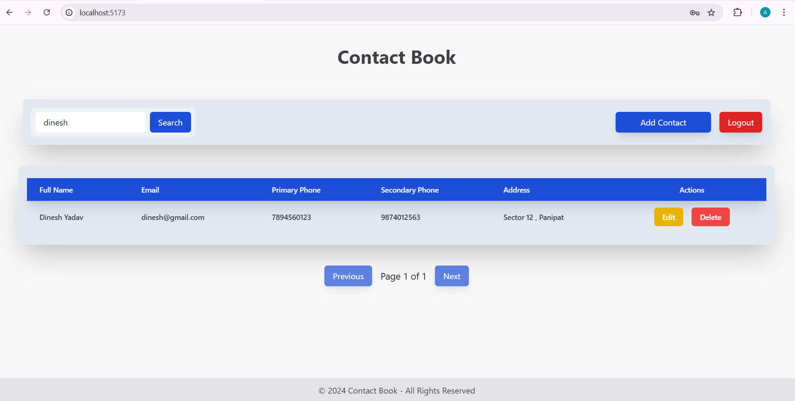

# Contact Book Application

This is a contact_book application made using react.js, node.js and mysql.

## Features

- *CRUD Operations*: Create, read, update, and delete items directly in the table.
- *Pagination*: Divide items across pages for easier navigation.
- *Sorting*:The table is sorted by fullname by default.

## Frontend UI

DashBoard  

Contact Form

Search Contact

Register

Login

 Install Dependencies for Both Backend and Frontend

###  Backend (Node.js)
Navigate to the backend folder and install dependencies:
cd backend
npm install

## Frontend (React)
In a separate terminal window, navigate to the frontend folder and install dependencies:
cd frontend
npm install

## Running the Application
1. Start the Backend Server
In the backend directory, start the Node.js server. This server provides the API for the CRUD operations.

Run ("node server.js")

The backend will run on http://localhost:8080 (or the port specified in your configuration).

1. Start the Frontend Development Server
In the frontend directory, start the React development server.

Run("npm run dev")

The frontend will run on http://localhost:5173 by default.

Usage
Add Items: Use the "Add" button to create a new entry in the table.

Edit Items: Click on a contact to edit its details and then save it.

Delete Items: Click the "Delete" button next to an item to remove it.

Search: You can search the contacts using the search bar.

License